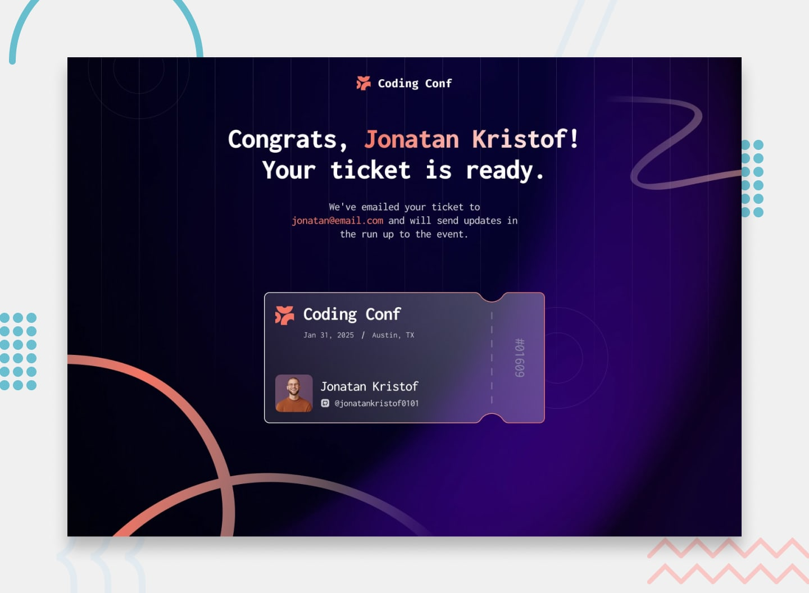

# 🎫 Conference Ticket Generator



A fully coded-from-scratch Conference Ticket Generator built as part of a [Frontend Mentor](https://www.frontendmentor.io/) challenge. This project showcases my frontend skills, including **HTML, CSS, JavaScript, accessibility, and responsive design**.

💻 **Source Code:** [GitHub Repo](https://github.com/kreetkashyap/conference-ticket-generator)

---

## 💡 Overview

This project allows users to:  

- Fill out a **registration form** with name, email, and GitHub username  
- Upload an **avatar (JPG/PNG under 500KB)**  
- Receive **real-time validation messages** for missing or invalid inputs  
- Generate a **personalized digital ticket** after submission  
- Enjoy a **responsive design** optimized for mobile, tablet, and desktop  
- Navigate and complete the form entirely via **keyboard**

---

## 🧠 Built With

- **HTML5** – Semantic structure  
- **CSS3** – Responsive layout, gradients, and transitions  
- **JavaScript (ES6)** – Form validation, DOM manipulation, dynamic ticket rendering  
- **Google Fonts (Inconsolata)** – Clean, developer-friendly typography  

---

## ✨ Highlights

- Custom form validation without external libraries  
- Dynamic ticket generation with smooth fade-in animation  
- Layered SVG backgrounds behind content for visual depth  
- Mobile-first design with media queries from 375px → 1440px  
- Accessible forms with ARIA attributes and live validation messages  

---

## 🧠 What I Learned

- Implementing **client-side validation** for multiple input types  
- Handling **file uploads** with FileReader API  
- Structuring **responsive layouts** for multi-device support  
- Layering and managing **SVG backgrounds** without breaking layout flow  
- Writing **clean, maintainable CSS and JavaScript** for real-world applications  

---

## 🔮 Future Improvements

- Save ticket data in **localStorage** for persistence  
- Add **QR code generation** for tickets  
- Implement **dark/light theme toggle**  
- Enhance **accessibility** with live announcements for screen readers  

---

## ⚡ Getting Started

1. **Clone the repository**:  
```bash
git clone https://github.com/kreetkashyap/conference-ticket-generator.git
```

2. Open the project:

- Navigate into the folder

- Open `index.html` in your browser

3. Use the app:

- Fill out the form and generate your personalized ticket

 > ✅ Works on mobile, tablet, and desktop with fully responsive layout


# 🎨 Design

- The project uses the designs provided in the /design folder

- Mobile and desktop versions are included to follow layout and spacing

- Fonts are included locally or via Google Fonts

# 💬 Credits

Challenge by Frontend Mentor

Fully coded and developed by **Kritika Kashyap**

## 📫 Contact

- GitHub: [@kreetkashyap](https://github.com/kreetkashyap)  
- Email: [kritikakashyap008@gmail.com](kritikakashyap008@gmail.com)